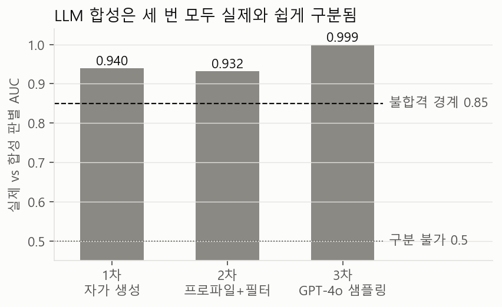
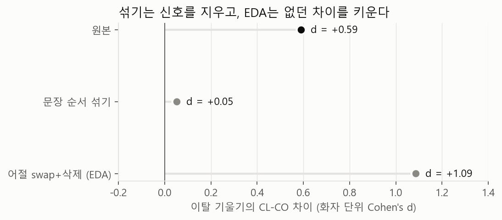
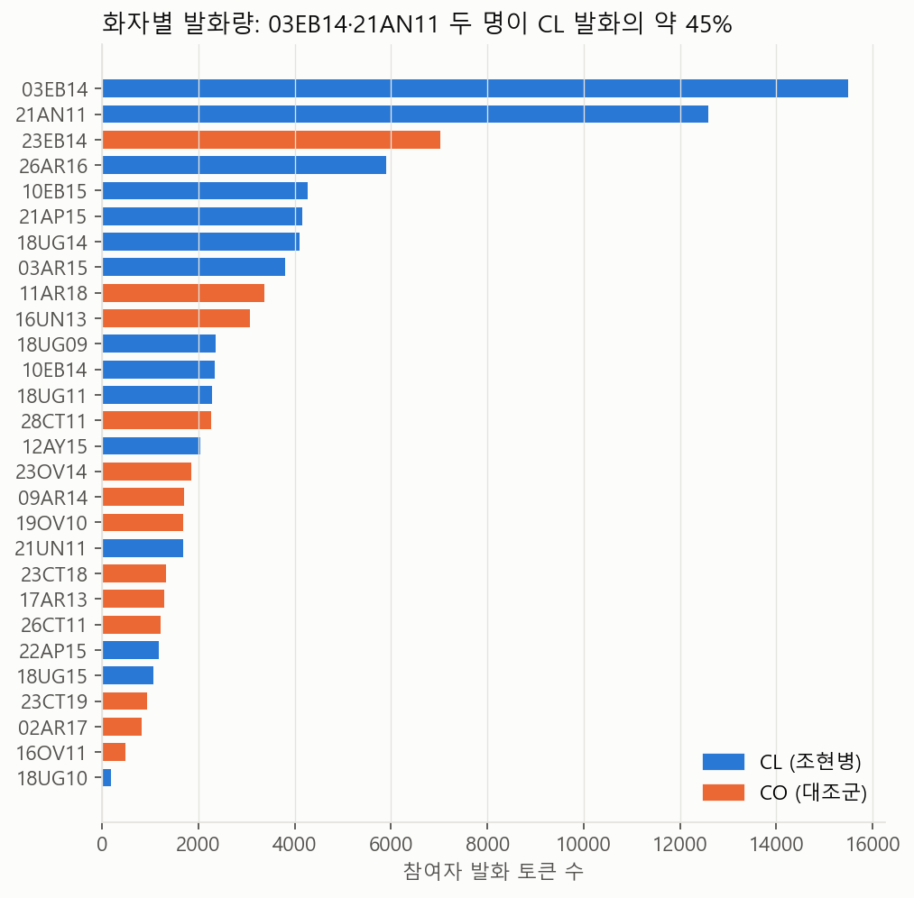
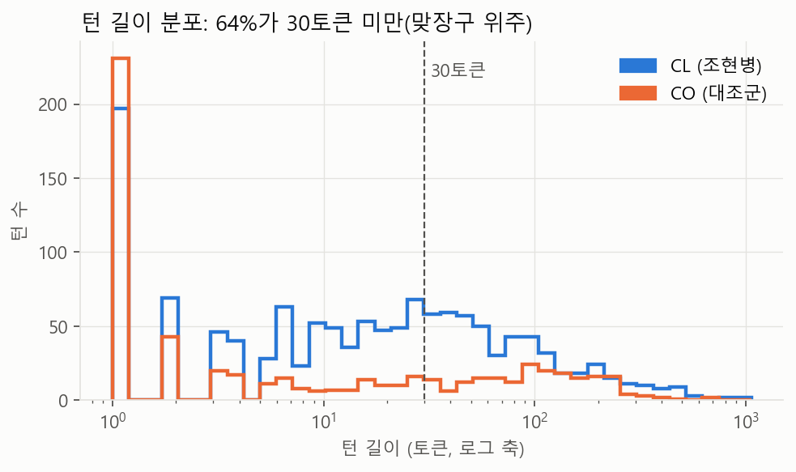
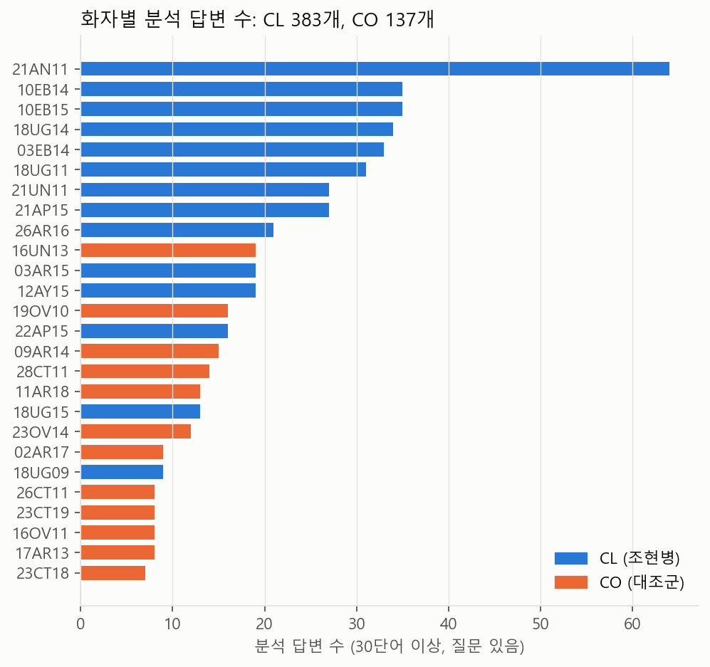
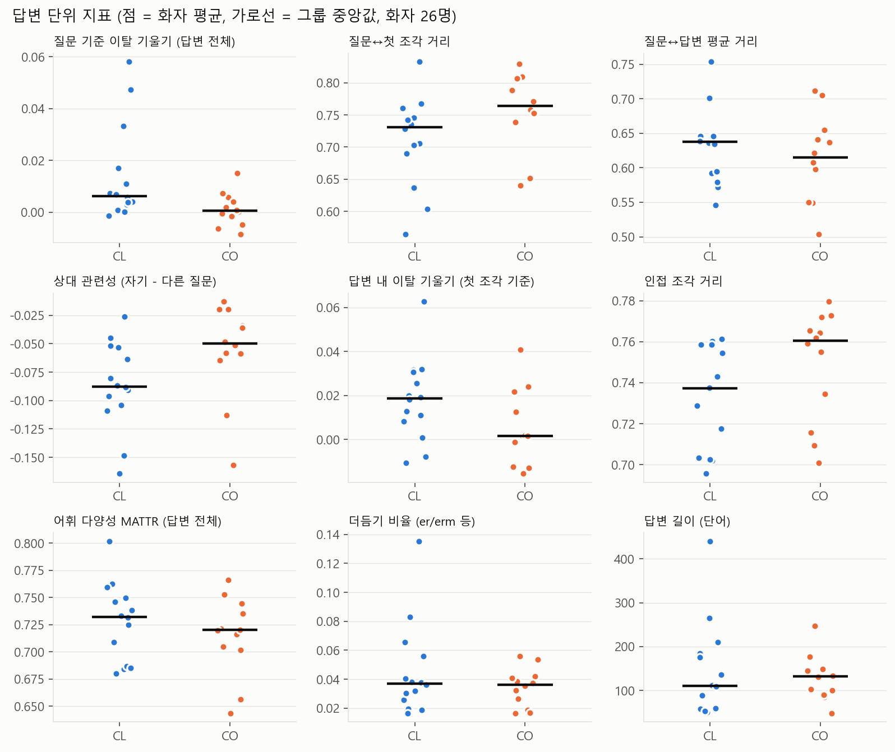
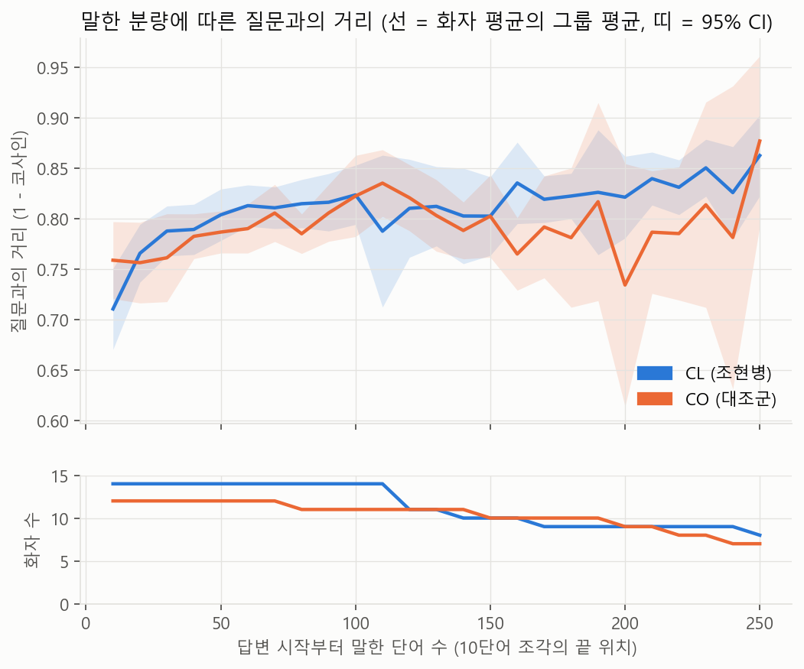
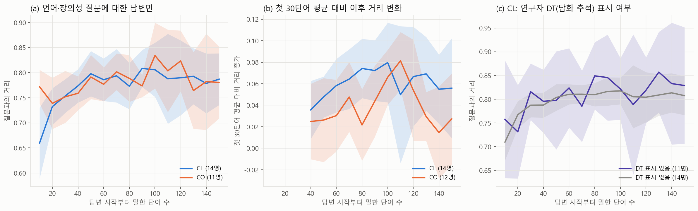

# 2026-10-02 작업 정리: 합성 증강 중단과 질문-답변 단위 분할

DAIS-C 데이터로 조현병 사고 이탈 연구를 진행하기 위해 데이터를 늘리는 방법을 검토했다. LLM 합성 증강은 세 번 시도한 끝에 중단했고, 대신 면담 질문 단위로 데이터를 자르기로 했다. 아래에 그 경과와 데이터 탐색 결과, 자르기 규칙, 지표의 분포와 검정 전 확인 결과, 참고 문헌을 적었고 계획은 맨 끝에 짧게 붙였다.

그림은 `reports/figures/`에 있다. 노션에 옮길 때는 그림 파일을 따로 올려야 한다.

## 1. 데이터 개요

DAIS-C(Discussing Abstract Ideas in Schizophrenia Corpus)는 영국 영어 비구조화 면담 코퍼스다. UK Data Service ReShare 855021에 CC BY-SA 4.0으로 공개돼 있다.

| 항목 | 값 |
|---|---|
| 화자 | 조현병군(CL) 15명, 대조군(CO) 13명. 메타데이터에는 31명이 있지만 3명은 전사가 없다 |
| 규모 | 참여자 턴 1,923개, 문장 5,079개, 토큰 약 9만 |
| 파일 종류 | 면담자 포함 전체 대화(Interactional), 참여자 발화만(speaker-only, 태그 유지/제거), 타임스탬프 |
| 전사 규약 | 구두점이 없다. 더듬기는 er, erm으로 적었다. 잘린 단어(w, wh)도 남겼다 |

speaker-only 파일 중 Raw 버전 두 개(21AN11, 21UN11)는 전체 대화 파일과 단어 수가 맞지 않아 쓰지 않는다. 태그가 남아 있는 speaker-only 파일과 Interactional 파일은 28명 모두 참여자 단어 수가 정확히 일치한다.

## 2. LLM 합성 증강: 과정과 실패 원인

### 2.1 무엇을 했나

화자 발화 몇 구간을 예시로 주고 같은 화자처럼 말하는 응답을 LLM이 새로 쓰게 했다. 결과는 네 가지 축으로 검증했다. 실제 데이터의 CL/CO 차이를 보존하는지(Fidelity), 합성끼리 서로 너무 비슷하지 않은지(Diversity), 원문을 베끼지 않았는지(Memorization), 실제와 합성을 판별기가 구분하지 못하는지(Discriminability)를 봤다. 판정 기준은 2차부터 생성 전에 커밋해서 고정했다.

| | 1차 | 2차 | 3차 |
|---|---|---|---|
| 방식 | Claude가 세션 안에서 직접 작성 | 1차 + 화자별 더듬기 수치 조건 + 사후 필터 | OpenAI gpt-4o 실제 샘플링 + 2차 조건과 필터 |
| 최종 규모 (CL/CO) | 112 (56/56) | 100 (50/50) | 96 (43/53) |
| Fidelity | 불합격 | 합격 | 합격 |
| Diversity | 주의 | 주의 | 불합격 |
| Memorization | 불합격 | 합격 | 합격 |
| 판별 AUC (≤0.85 필요) | 0.940 | 0.932 | 0.999 |

세 번 모두 판별 가능성 기준을 넘지 못했다. 원문 복사와 가짜 그룹 효과는 시도를 거치며 줄었지만, 실제와 합성은 매번 쉽게 구분됐다.

### 2.2 왜 실패했나

판별기가 잡은 단서는 매번 어휘 수준의 말버릇이었다. 1차 합성은 지나치게 정돈돼 있었다(erm 과용, quite와 actually 같은 표현). 2차에서 "다른 말로 다시 쓰라"고 지시하자 어휘 다양성이 실제보다 높아졌다. 3차에서 더듬기를 넣으라고 하자 이번에는 더듬기가 넘쳤다. 10,000단어당 빈도로 보면 다음과 같다.

| 표현 | 실제 | 1차 | 2차 | 3차 |
|---|---|---|---|---|
| um | 0.1 | 0 | 0 | 64.2 |
| sort of | 45.1 | 37.0 | 9.7 | 140.7 |
| kind of | 52.6 | 55.5 | 13.4 | 129.4 |
| you know | 84.8 | 43.7 | 65.7 | 195.5 |

지시는 방향을 바꿀 수 있어도 양을 맞추지는 못했다. 지시를 하나 고치면 다른 쪽이 넘쳤고, 세 번 반복해도 수렴하지 않았다. um은 이 코퍼스의 전사 규약(er/erm)에 없는 표기인데 3차에서 지시를 어기고 나왔다.

이탈 지표 자체도 왜곡됐다. 1·2차 합성에서는 CL 응답이 첫 문장에서 멀어지는 정도를 실제보다 과장했다(first_dist d=0.48, 실제는 −0.01). LLM이 가진 "조현병 환자는 말이 샌다"는 고정관념이 들어간 것으로 보인다. 이런 데이터로 이탈 지표를 검증하면 LLM이 주입한 효과를 측정하게 된다.

실제 데이터에 합성을 섞어 학습해도 분류 성능은 오르지 않았다(AUC 변화 −0.004에서 +0.004, 반복 간 표준편차는 0.013 이상). 합성만으로 학습하면 실제만 쓸 때보다 AUC가 0.09에서 0.20 낮았다.

### 2.3 선행 합성 연구와 무엇이 다른가

정신건강 분야의 합성 연구는 2024년 이후 늘고 있다. 확인한 연구들은 모두 이 연구와 조건이 달랐다.

| 연구 | 합성 대상 | 사용 방식 |
|---|---|---|
| Kang et al. 2024 (우울증) | 면담 전사의 요약문 | 구어 전사를 직접 생성하면 더듬기와 반복이 문제가 된다고 적고 요약으로 우회했다 |
| Gutiérrez et al. 2025 (조현병, 연합 이완) | 짧은 대화 조각 800개 | 합성으로 학습하고 문헌 속 실제 사례로 평가했다. 정확도 82%, AUC 0.87 |
| LLMCARE 2025 (치매) | 합성 전사 | 실제에 섞어 재학습해 F1이 78.2에서 81.0으로 올랐다 |
| AnchorSIPS 2026 (정신병 고위험) | 면담 전사 | 학습용이 아니라 평가용 벤치마크로 공개했다 |

공통점은 짧은 조각이나 요약을 만들고, 평가는 반드시 실제 데이터로 하며, 목표가 내용 판별이라는 것이다. 이 연구는 긴 발화의 순서와 더듬기를 그대로 재현해야 하고 그 순서 자체를 측정한다. Kang et al.이 문제로 보고 요약으로 피해 간 것도 바로 이 더듬기와 반복이었다.

자세한 경과는 `archive/augmentation/REPORT.md`에 있다.

## 3. 규칙 기반 증강(섞기, EDA)을 쓰지 않는 이유

텍스트 증강이라고 하면 보통 EDA(Wei & Zou 2019)를 말한다. 문장 안에서 동의어 치환, 무작위 삽입, 어절 순서 바꾸기, 어절 삭제를 한다. nlpaug의 RandomSentAug처럼 문장 순서를 섞는 도구도 있다. 이런 방법은 순서가 라벨과 무관한 과제(감성 분류 등)를 전제로 한다.

이 연구의 핵심 지표는 "답하면서 의미가 얼마나 빨리 멀어지는가"이므로 순서 자체가 측정 대상이다. 실제로 적용해서 확인했다(응답 단위 368개, 화자 28명, 화자 평균으로 그룹 비교).

| 조건 | 평균 기울기 | CL−CO 효과 크기 d | Mann-Whitney p |
|---|---|---|---|
| 원본 | 0.0143 | +0.59 | 0.150 |
| 문장 순서 섞기 | 0.0000 | +0.05 | 0.314 |
| EDA 어절 swap + 삭제 (10%) | 0.0129 | +1.09 | 0.024 |

문장을 섞으면 기울기가 0이 되고, 원본 기울기와의 상관도 0.07로 떨어진다. EDA는 원본에서 유의하지 않던 차이를 유의하게 만들었다. 잡음이 두 그룹에 다르게 작용해서 생긴 가짜 효과다.

일관성 연구에서는 순서를 섞은 텍스트를 "비일관 텍스트" 대조군으로 쓴다(Barzilay & Lapata 2008). 이 연구에서도 원본 기울기가 섞은 텍스트보다 큰지 확인하는 데 쓸 계획이다.

다른 방식도 같이 확인했다.

- speaker-only 파일에 10문장 윈도우를 씌우면 효과 방향이 뒤집혔다(d −0.36). 면담자 질문이 빠진 파일이라 윈도우가 질문을 건너뛰면 면담자가 바꾼 주제가 참여자의 이탈로 잡힌다.
- 면담 전체에 기울기를 구하면 거의 0이었다(0.0002). 수백 문장이 쌓이면 첫 문장과의 거리가 금방 포화된다.
- 조각을 사람 구분 없이 섞어 교차검증하면 AUC가 0.59에서 0.61, 사람 단위로 나누면 0.51에서 0.56이었다. 같은 사람의 조각이 학습과 평가 양쪽에 들어가면 모델이 말투를 외워서 성능이 부풀려진다(Saeb et al. 2017).
- 더듬기(er/erm)를 지우고 기울기를 다시 구해도 결과는 거의 같았다(상관 0.95, d 0.59 대 0.58). 그래서 더듬기는 지우지 않고 원문 그대로 쓰며, 더듬기 비율은 별도 지표로 센다.

재현: `python src/check_aug_impact.py`

## 4. 데이터 탐색에서 확인한 특징

### 4.1 발화량과 턴 길이

화자마다 발화량 차이가 크다. 03EB14와 21AN11 두 명이 CL 전체 발화의 약 45%를 차지한다. 그래서 분석은 화자 단위로 집계해야 한다. CL 화자의 문장 수 중앙값이 160, CO가 109로 차이가 나지만, 두 그룹은 시작 질문과 면담 방식이 달라서 이 차이를 질환의 특징으로 해석하지 않는다.

턴의 64%가 30토큰 미만이고 대부분 "yeah", "OK" 같은 맞장구다. 그래서 분석 단위는 턴 대신 질문에 대한 답변으로 잡았다.

### 4.2 그룹과 겹친 조건들

메타데이터를 보면 그룹 말고도 CL과 CO를 가르는 조건이 여럿 있다. 면담 방식부터 성별까지는 메타데이터 31명 기준이다. 시작 질문은 전사가 있는 28명, 질문 길이는 질문-답변 단위(§5)에서 잰 값이다.

| 조건 | CL | CO |
|---|---|---|
| 면담 방식 | 전화 11, 대면 5 | 전원 화상통화 |
| 녹음 장비 | 스피커폰→마이크, 노트북 마이크 | 전원 녹음 소프트웨어 |
| 음질 excellent | 5명 | 12명 |
| 성별 | 남 13, 여 3 | 남 3, 여 12 |
| 시작 질문 | 창의성 질문 14, 실험 소감 1 | 창의성 질문 3, 실험 소감 10 |
| 면담자 질문 길이 중앙값 (분석 답변 기준) | 14단어 | 21단어 |

이 조건들은 분석에서 보정하거나 한계로 보고해야 한다. 녹음 방식이 그룹과 완전히 겹치기 때문에 소리에 기대는 지표는 질환 효과와 녹음 효과를 구분할 수 없다. 텍스트 의미 지표를 택한 근거 중 하나이기도 하다.

### 4.3 태그

원본에는 웃음, 청취 불가, 익명화 같은 태그와 연구자가 직접 표시한 판단 태그가 있다. 화자별 1,000단어당 개수를 비교했다.

| 태그 | 뜻 | CL | CO | p | 처리 |
|---|---|---|---|---|---|
| InAu | 청취 불가 | 3.75 | 0.28 | 0.041 | 지표로 쓰지 않음. 발음 문제인지 전화 녹음 탓인지 구분할 수 없다 |
| An | 익명화 | 3.23 | 0.38 | 0.005 | 지표로 쓰지 않음. 연구자가 개인정보를 가린 흔적이다 |
| Lh | 웃음 | 2.95 | 10.43 | 0.004 | 탐색용으로만 본다. 집에서 화상으로 실험 소감을 말한 상황의 영향일 수 있다 |
| Gr | 문법 이상 (연구자 판단) | 4.72 | 2.33 | 0.016 | 검증 기준 |
| DT | 담화 추적 어려움 (연구자 판단) | 1.40 | 0.28 | 0.003 | 검증 기준 |
| TC | 사고 완결 (연구자 판단) | 1.85 | 2.22 | 0.596 | 검증 기준 |

Gr, WS, TC, DT는 사람 전문가가 읽고 붙인 표시라서 자동 지표의 입력으로 넣으면 순환 논리가 된다. 새 환자의 전사에는 이 표시도 없다. 대신 "자동 이탈 지표가 높은 답변에 연구자도 DT를 많이 붙였는가"를 확인하는 기준으로 쓴다. Elvevåg et al.(2007)이 자동 기울기와 맹검 평정의 상관(r=0.44)으로 지표를 검증한 방식과 같다.

태그는 SBERT에 넣는 텍스트에서만 지우고, 개수는 답변별로 따로 보관한다.

## 5. 데이터 자르기: 질문-답변 단위

### 5.1 규칙

1. Interactional 파일(docx/rtf)에서 면담자와 참여자의 턴 순서를 그대로 읽는다.
2. 면담자 턴이 실제 질문이면 그 질문이 다음 답변의 기준점이 된다. 맞장구어(mm, yeah, OK 등)를 빼고 3단어 이상 남으면 질문으로 본다.
3. 면담자가 맞장구만 하고 참여자가 이어 말하면 앞뒤 참여자 턴을 한 답변으로 합친다. 354건이 이렇게 합쳐졌다.
4. 23EB14(CO)는 면담자 발화가 전부 Mis(전사 누락) 태그로 돼 있다. 누락 지점을 답변 경계로 쓰고 기준점 텍스트는 비워 둔다. 이 화자는 질문 기준 지표에서 빠진다.
5. 답변은 자르지 않고 처음부터 끝까지 10단어 조각으로 나눈다(Corcoran et al. 2018의 k단어 방식). 마지막 조각이 5단어 미만이면 버린다.
6. 30단어(3조각) 이상인 답변만 쓰고, 위치는 250단어까지만 쓴다. 그 뒤로는 아주 길게 답한 몇 명만 남기 때문이다.

순서를 섞거나 원문을 바꾸지 않으므로 이탈 지표가 왜곡되지 않는다. 늘어나는 것은 분석 단위 수이고, 독립 표본은 여전히 사람 수다.

### 5.2 결과

답변은 1,342개가 나왔다. 질문이 있는 답변 중 절반 이상은 짧은 대답이다(답변 길이 중앙값 CL 20단어, CO 2단어). 30단어 이상이라 분석에 들어가는 답변은 520개(CL 383, CO 137), 화자 26명(CL 14, CO 12)이다. 분석에 쓰인 단어는 질문 있는 답변 전체의 CL 71%, CO 89%다. CL이 낮은 것은 250단어 상한 때문이다(상한에 걸린 답변 CL 15%, CO 7%).

화자당 답변 수 차이가 크다(21AN11처럼 많은 사람과 몇 개뿐인 사람). 분석할 때 화자 단위로 집계한다.

### 5.3 시행착오: 앞 4문장 방식을 버린 이유

처음에는 spaCy로 나눈 문장 중 답변의 앞 4문장만 썼다. 확인해 보니 이 방식은 두 가지 문제가 있었다.

- 답변 하나는 보통 130~140단어(7~8문장)인데 앞 4문장은 그중 중앙값 CL 53%, CO 68%만 본다. 이탈이 드러날 답변 뒤쪽을 잘라 내고, 보는 비율도 그룹마다 다르다.
- 앞 4문장의 단어 수가 CL 60, CO 80으로 달랐다. 문장 수로는 길이가 맞춰지지 않는다. 구두점이 없어 문장 경계도 파서의 추정이다.

그래서 답변 전체를 단어 조각으로 나누는 방식으로 바꿨다. 이 변경은 앞 4문장 기준의 기술통계를 본 뒤에 결정했다. 바꾼 근거는 결과가 아니라 위의 길이 문제다.

## 6. 지표 (기술통계)

의미 거리는 SBERT(all-MiniLM-L6-v2) 임베딩의 코사인 거리다. 아래 수치는 분포를 보기 위한 것이고, 그룹 검정은 분석 계획을 고정한 뒤에 한다. d는 화자 평균으로 구한 Cohen's d다.

| 지표 | 계산 | CL 중앙값 | CO 중앙값 | d |
|---|---|---|---|---|
| 질문 기준 이탈 기울기 | 질문과 각 조각의 거리를 위치에 대해 회귀한 기울기 (답변 전체) | 0.0063 | 0.0005 | +0.93 |
| 같은 기울기, 앞 100단어 | 길이를 100단어로 맞춤 (25명) | 0.0116 | 0.0063 | +0.81 |
| 같은 기울기, 앞 150단어 | 길이를 150단어로 맞춤 (20명) | 0.0042 | 0.0015 | +0.24 |
| 질문↔첫 조각 거리 | 첫 10단어가 질문과 얼마나 먼가 | 0.731 | 0.764 | −0.74 |
| 질문↔답변 평균 거리 | 답변 중심 벡터와 질문의 거리 | 0.637 | 0.615 | +0.33 |
| 상대 관련성 | 자기 질문 거리에서 같은 면담의 다른 질문들과의 평균 거리를 뺀 값 | −0.088 | −0.050 | −0.75 |
| 답변 내 이탈 기울기 | 첫 조각 기준 기울기 (계획서 원안) | 0.019 | 0.002 | +0.72 |
| 인접 조각 거리 | 앞 조각과 끊기는 정도 | 0.737 | 0.760 | −0.63 |
| MATTR | 답변 전체 어휘 다양성 (창 50) | 0.732 | 0.720 | +0.36 |
| 더듬기 비율 | er, erm, mm, mhm, ah, oh 비율 | 0.037 | 0.036 | +0.44 |

fig7은 답변을 시작한 뒤 몇 단어째에 질문과 얼마나 멀어졌는지를 그룹별로 그린 것이다. 두 그룹 모두 처음 50단어 동안 빠르게 멀어지고 그 뒤로는 거의 평평하다. 첫 10단어에서는 CL이 질문에 더 가깝고(0.71 대 0.76), 150단어 이후에는 CL이 조금 위에 있지만 신뢰구간이 거의 전 구간에서 겹친다.

기울기 차이(d +0.93)는 두 가지가 섞인 값이다. 곡선이 처음에 가파르고 뒤에 평평하기 때문에 짧게 답한 사람은 가파른 구간만 잡혀 기울기가 커진다. 기울기가 가장 높은 CL 3명(10EB14, 21UN11, 22AP15)은 답변 길이 중앙값이 37~53단어였다. 그리고 CL은 출발점이 질문에 더 가까워서 같은 끝점이라도 기울기가 커진다. 길이를 100단어로 맞춘 값(d +0.81)이 앞의 문제를 덜 받는다.

가장 뚜렷한 차이는 첫 조각 거리, 상대 관련성, 인접 조각 거리에서 나왔는데, 세 지표 모두 CL이 질문에 더 붙어 있고 덜 끊기는 방향이다. CL은 대부분 "언어를 창의적으로 쓴다고 느끼세요?" 같은 예/아니오형 질문으로 시작했고, 이런 질문에는 질문 단어를 되받아 답하기 쉽다. 녹음 방식과 성별 교락까지 있어서 이 차이를 질환 효과로 보기 어렵다.

## 7. 검정 전 확인

p값 없이 그림으로 확인할 수 있는 세 가지를 봤다. 질문 주제는 키워드로 1차 분류했다(언어·창의성 질문 CL 118, CO 56개 답변. 실험 질문은 거의 CO에만 있다).

| 확인 | 화자 | 결과 |
|---|---|---|
| (a) 언어·창의성 질문에 대한 답변만 비교 | CL 14, CO 10 | 앞 100단어 기울기 d +0.76. 곡선은 첫 10단어를 빼면 거의 겹친다 |
| (b) 첫 30단어 평균을 출발점으로 맞춘 뒤의 변화 (40~150단어) | CL 14, CO 12 | 기울기 d 0.00 |
| (c) CL 안에서 연구자가 DT(담화 추적 어려움)를 표시한 답변과 아닌 답변 | 11명 | DT 쪽 기울기가 큰 사람 11명 중 4명. 곡선도 구분되지 않는다 |

(b)에서 출발점을 첫 10단어 하나로 잡지 않은 이유가 있다. 첫 조각이 우연히 질문에 가까웠던 답변은 다음 조각에서 저절로 멀어 보이는데(평균으로의 회귀), CL은 첫 조각이 더 가까워서 이 착시를 더 크게 받는다. 첫 30단어 평균으로 잡으면 이 영향이 줄어든다.

세 확인을 합치면, 이탈 기울기의 그룹 차이는 거의 다 답변 첫 30단어 안에서 생긴다. 그 이후에 CL이 더 빨리 멀어지는 모습은 보이지 않는다. 자동 기울기는 연구자의 DT 판단과도 맞지 않았다. 지금 데이터로는 "말할수록 조현병 환자가 더 멀어진다"는 가설을 뒷받침하는 그림이 나오지 않는다. 남는 차이는 답변의 출발 부분에서 CL이 질문에 더 붙어 있다는 것인데, 질문 형식과 면담 방식의 영향을 배제하지 못한다.

## 8. 파일 정리

LLM 증강 관련 코드, 리포트, 합성 데이터는 `archive/augmentation/`으로 옮겼다. 시도별 요약 4개는 `archive/augmentation/REPORT.md` 하나로 합쳤다. 원문 발췌가 든 리포트와 합성 데이터는 git에서 계속 제외된다. 과거 커밋 이력에도 들어간 적이 없는 것을 확인했다.

| 위치 | 내용 |
|---|---|
| `src/preprocess.py` | 태그 제거, 문장 분할 |
| `src/build_qa_units.py` | 질문-답변 단위 자르기 |
| `src/check_aug_impact.py` | 증강 방식별 영향 실측 (§3) |
| `src/summary_figures.py` | 그림 1~4 (증강 결과, 데이터 개요) |
| `src/position_features.py` | 10단어 조각 지표, 그림 5~8, `reports/03_features.md` |
| `reports/00_exploration.md`, `01_preprocess.md`, `02_qa_units.md`, `03_features.md` | 탐색, 전처리, 단위 구축, 지표와 확인 |
| `archive/augmentation/` | 종료한 LLM 증강 작업 전체 |

## 9. 참고 문헌

데이터

- Delgaram-Nejad O, Archer D, Chatzidamianos G, Robinson L, Bartha A. The DAIS-C: A small, specialised, spoken, schizophrenia corpus. Applied Corpus Linguistics. 2023;3(3):100069. https://doi.org/10.1016/j.acorp.2023.100069 (데이터 DOI 10.5255/UKDA-SN-855021)

이탈과 일관성 지표

- Elvevåg B, Foltz PW, Weinberger DR, Goldberg TE. Quantifying incoherence in speech: an automated methodology and novel application to schizophrenia. Schizophr Res. 2007;93:304–316. https://doi.org/10.1016/j.schres.2007.03.001 (질문 기준 LSA 거리 기울기, 맹검 평정과 r=0.44)
- Bedi G, et al. Automated analysis of free speech predicts psychosis onset in high-risk youths. NPJ Schizophr. 2015;1:15030. https://www.nature.com/articles/npjschz201530 (인접 구절 일관성, N=34)
- Corcoran CM, et al. Prediction of psychosis across protocols and risk cohorts using automated language analysis. World Psychiatry. 2018;17(1):67–75. https://doi.org/10.1002/wps.20491 (k-단어 일관성, 교차 코호트 검증)
- Iter D, Yoon J, Jurafsky D. Automatic detection of incoherent speech for diagnosing schizophrenia. CLPsych 2018:136–146. https://aclanthology.org/W18-0615/ (더듬기와 반복이 일관성 지표에 잡음을 넣는다고 보고)
- Tang SX, et al. Natural language processing methods are sensitive to sub-clinical linguistic differences in schizophrenia spectrum disorders. NPJ Schizophr. 2021;7:25. https://doi.org/10.1038/s41537-021-00154-3 (BERT 문장 거리, 20 대 11명)
- Rezaii N, Walker E, Wolff P. A machine learning approach to predicting psychosis using semantic density and latent content analysis. NPJ Schizophr. 2019. https://pmc.ncbi.nlm.nih.gov/articles/PMC6565626/ (단어 섞기 대조)
- Just S, et al. Coherence models in schizophrenia. CLPsych 2019. https://aclanthology.org/W19-3015/
- Barzilay R, Lapata M. Modeling local coherence: An entity-based approach. Computational Linguistics. 2008;34(1):1–34. https://aclanthology.org/J08-1001.pdf (문장 순서 섞기를 비일관 대조군으로 사용)

증강 도구와 증강 연구

- Wei J, Zou K. EDA: Easy data augmentation techniques for boosting performance on text classification tasks. EMNLP-IJCNLP 2019. https://github.com/jasonwei20/eda_nlp
- nlpaug. https://github.com/makcedward/nlpaug
- TextAttack. https://github.com/QData/TextAttack
- AugLy. https://github.com/facebookresearch/AugLy
- Woszczyk D, Hlédiková A, Akman A, Demetriou S, Schuller B. Data augmentation for dementia detection in spoken language. Interspeech 2022:2858–2862. https://www.isca-archive.org/interspeech_2022/woszczyk22_interspeech.html
- Luz S, et al. Alzheimer's dementia recognition through spontaneous speech: The ADReSS challenge. Interspeech 2020. https://www.isca-archive.org/interspeech_2020/luz20_interspeech.html

LLM 합성 데이터

- Kang, Chen, Lee-Youngzie, Fu. Synthetic data generation with LLM for improved depression prediction. arXiv:2411.17672. 2024. https://arxiv.org/abs/2411.17672
- Gutiérrez et al. Interpretable LLM-based detection of loose associations using synthetic speech data in early psychosis. Schizophr Bull. 2025. https://pmc.ncbi.nlm.nih.gov/articles/PMC13391620/
- LLMCARE: early detection of cognitive impairment via transformer models enhanced by LLM-generated synthetic data. arXiv:2508.10027. 2025. https://arxiv.org/pdf/2508.10027
- Oliveira GC, et al. AnchorSIPS: A synthetic dataset and evaluation resource for evidence-supported psychosis-risk symptom measurement. arXiv:2608.12329. 2026. https://arxiv.org/abs/2608.12329 (본문 세부는 확인하지 못함)
- 스페인어 정신과 평가 보고서 합성. arXiv:2604.27014. https://arxiv.org/html/2604.27014v1

검증 방법

- Saeb S, Lonini L, Jayaraman A, Mohr DC, Kording KP. The need to approximate the use-case in clinical machine learning. GigaScience. 2017;6(5):gix019. https://pmc.ncbi.nlm.nih.gov/articles/PMC5441397/ (기록 단위 교차검증이 성능을 크게 부풀린다)
- Little MA, et al. Using and understanding cross-validation strategies. GigaScience. 2017;6(5):gix020. https://academic.oup.com/gigascience/article/6/5/gix020/3073663
- Chaibub Neto E, et al. Detecting the impact of subject characteristics on machine learning-based diagnostic applications. NPJ Digit Med. 2019. https://www.nature.com/articles/s41746-019-0178-x

## 10. 다음 계획

1. 질문 주제를 키워드 대신 사람이 직접 라벨링한다(언어·창의성, 실험, 개인 대화, 되묻기 등). 같은 주제 비교(7장 a)를 제대로 다시 본다.
2. 출발점과 이후 변화를 나누는 모형을 고정한다: 거리 ~ 그룹 × 로그(위치) + 시작 질문 + 성별 + 질문 길이 + 답변 길이 + (화자, 답변별 차이). 결과를 보기 전에 커밋한다.
3. 7장 결과로 보면 주 가설(이후 구간의 더 빠른 이탈)은 약하다. 검정은 계획대로 하되, "첫 30단어의 질문 밀착"과 교락 요인 정리를 함께 보고하는 방향을 팀에서 정한다.
4. 분류(로지스틱 기준선, LightGBM)는 leave-one-speaker-out으로 평가하고 예측은 화자 단위로 집계한다. 라벨 순열로 우연 수준을 확인한다.
5. 민감도 분석: 조각 크기(5·20단어), 상한(150·200단어), 더듬기 제거본, 짧은 질문 제외.
